# Azure Threat Detection Lab
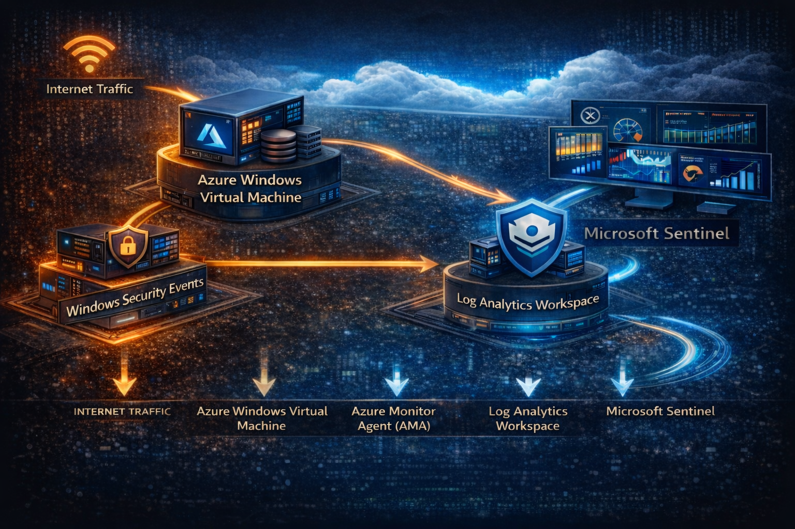

## Overview

This project demonstrates a **cloud threat detection engineering workflow** using Microsoft Sentinel and Azure Log Analytics.

The objective of this project was to simulate attacker behaviors on a Windows virtual machine and develop detection logic capable of identifying malicious activity using **Kusto Query Language (KQL)**.

Telemetry is collected using **Windows Security Events** and forwarded to Azure via the **Azure Monitor Agent (AMA)**. The events are then analyzed within **Microsoft Sentinel** to build and validate threat detections mapped to **MITRE ATT&CK techniques**.

This project demonstrates a typical **detection engineering lifecycle**:

1. Simulate attacker behavior
2. Collect security telemetry
3. Develop detection logic
4. Validate detection queries
5. Convert detections into Sentinel analytics rules

---

# Lab Architecture

The lab environment consists of an Azure Windows virtual machine generating security telemetry that is collected and analyzed through Microsoft Sentinel.

## Telemetry flow:

Internet Traffic  
↓  
Azure Windows Virtual Machine  
↓  
Windows Security Event Logs  
↓  
Azure Monitor Agent (AMA)  
↓  
Log Analytics Workspace  
↓  
Microsoft Sentinel  
↓  
Threat Detection Queries


# Detection Engineering Methodology

Each detection in this project follows a structured workflow used by detection engineers:

Threat Scenario – Adversary technique being simulated
Telemetry Source – Windows event logs used for detection
Detection Logic – KQL query used to identify suspicious behavior
Validation – Attack simulation used to generate telemetry
Detection Output – Evidence that the detection works

## Detection 1 — Brute Force Login Detection

**`MITRE ATT&CK:`** T1110 – Brute Force

**`Threat Scenario:`** Attackers often attempt to gain access to systems through repeated authentication attempts against user accounts.

**`Telemetry Source:`** Windows Security Event Log

**`Event ID:`** 4625 – Failed Logon Attempt

### Detection Logic
```KQL
SecurityEvent
| where EventID == 4625
| summarize FailedAttempts=count() by Account, Computer, bin(TimeGenerated, 5m)
| where FailedAttempts > 5
| sort by FailedAttempts desc
```

### Detection Output
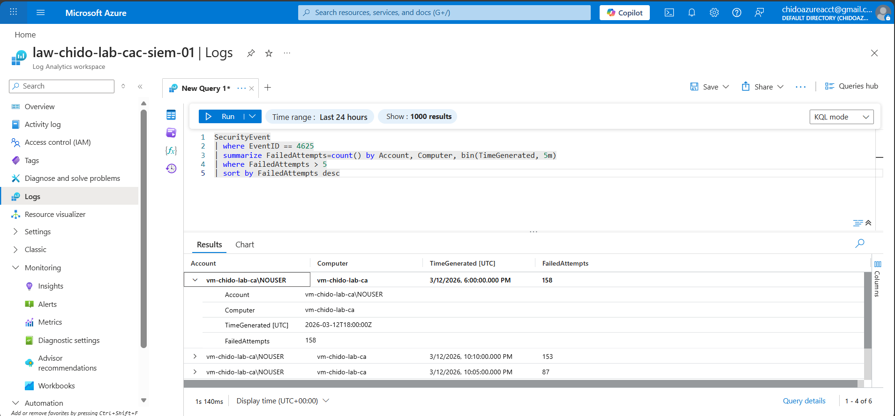

## Detection 2 — Encoded PowerShell Execution

**`MITRE ATT&CK:`** T1059 – Command and Scripting Interpreter (PowerShell)

**`Threat Scenario:`** Attackers frequently execute PowerShell using encoded commands to obfuscate malicious scripts and evade detection.

**`Telemetry Source:`**: Windows Security Event Log

**`Event ID:`** 4688 – Process Creation


### Detection Logic
```kql
SecurityEvent
| where EventID == 4688
| where Process has "powershell"
| where CommandLine contains "-EncodedCommand"
| project TimeGenerated, Computer, Account, Process, CommandLine
```

### Detection Output


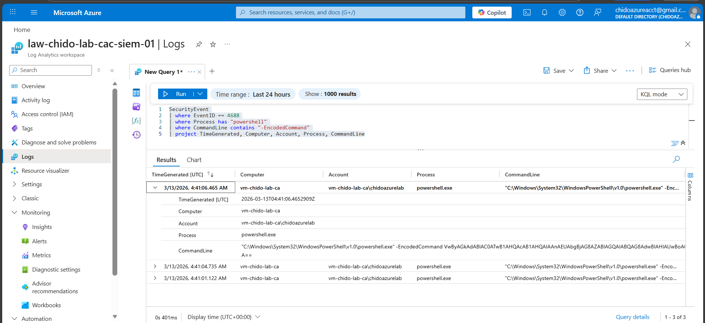


## Detection 3 — Suspicious Parent Process Execution

**`MITRE ATT&CK:`** T1059 – Command Execution

**`Threat Scenario:`** Attackers may spawn PowerShell from unusual parent processes such as cmd.exe or wmic.exe to execute malicious commands.

**`Telemetry Source:`** Windows Security Event Log

**`Event ID:`** 4688 – Process Creation

### Detection Logic

```kql
SecurityEvent
| where EventID == 4688
| where Process has "powershell"
| where ParentProcessName !contains "explorer.exe"
| project TimeGenerated, Computer, Process, ParentProcessName, Account
```

### Detection Output

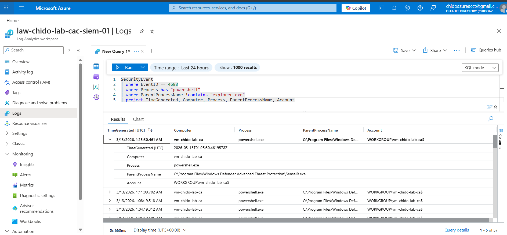


## Detection 4 — Network Beaconing Activity

**`MITRE ATT&CK:`** T1071 – Application Layer Protocol

**`Threat Scenario:`** Malware commonly communicates with command-and-control servers using frequent outbound connections.

**`Telemetry Source:`** Sysmon Network Connection Logs

**`Event ID:`** 3 – Network Connection

### Detection Logic

```kql
Event
| where Source == "Microsoft-Windows-Sysmon"
| where EventID == 3
| summarize Connections=count() by Computer, bin(TimeGenerated, 1m)
| where Connections > 20
```

### Detection Output

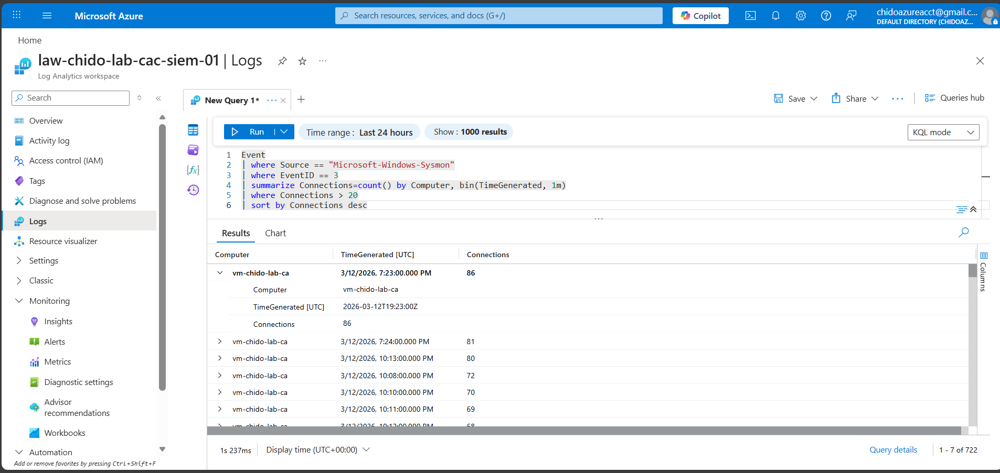


## Detection 5 — Privileged Logon Activity

**`MITRE ATT&CK:`** T1078 – Valid Accounts

**`Threat Scenario:`** Attackers may leverage privileged accounts to escalate privileges or perform administrative actions.

**`Telemetry Source:`** Windows Security Event Log

**`Event ID:`** 4672 – Special Privileges Assigned to New Logon

### Detection Logic

```kql
SecurityEvent
| where EventID == 4672
| project TimeGenerated, Account, Computer
| sort by TimeGenerated desc
```

### Detection Output

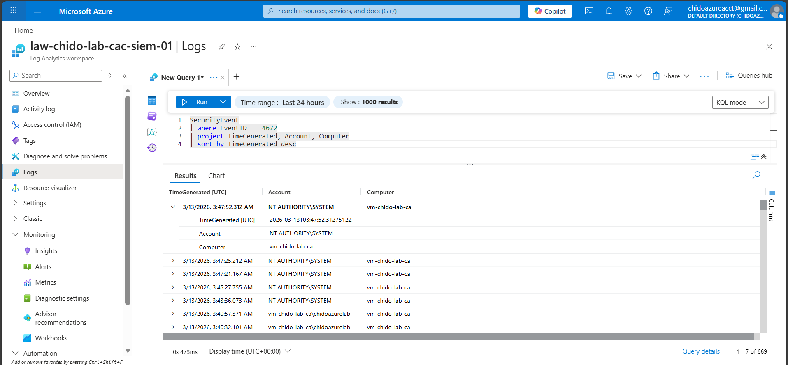

## Detection 6 — Scheduled Task Persistence

**`MITRE ATT&CK:`** T1053 – Scheduled Task / Job

**`Threat Scenario:`** Attackers create scheduled tasks to maintain persistence within compromised systems.

**`Telemetry Source:`** Windows Security Event Log

**`Event ID:`** 4698 – Scheduled Task Created

### Detection Logic

```kql
SecurityEvent
| where EventID == 4698
| project TimeGenerated, Computer, Activity
Detection Output
```
### Detection Output

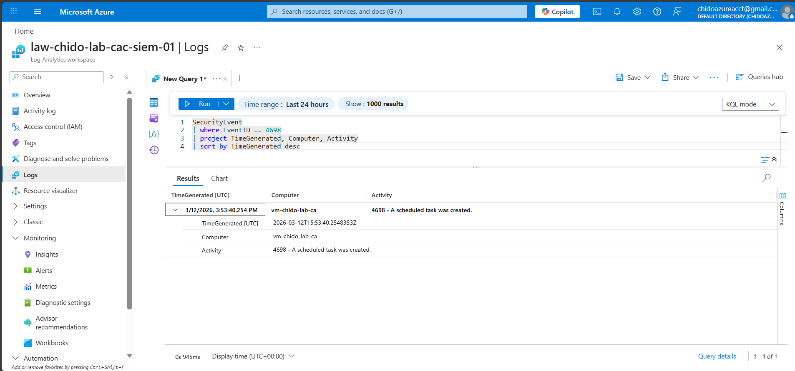


## Detection 7 — Suspicious Service Creation

**`MITRE ATT&CK:`** T1543 – Create or Modify System Process

**`Threat Scenario:`** Attackers may install malicious services to execute malware or maintain persistence.

**`Telemetry Source:`** Windows Security Event Log

**`Event ID:`** 4697 – Service Installed


### Detection Logic
```kql
SecurityEvent
| where EventID == 4697
| project TimeGenerated, Account, Computer, Activity
```

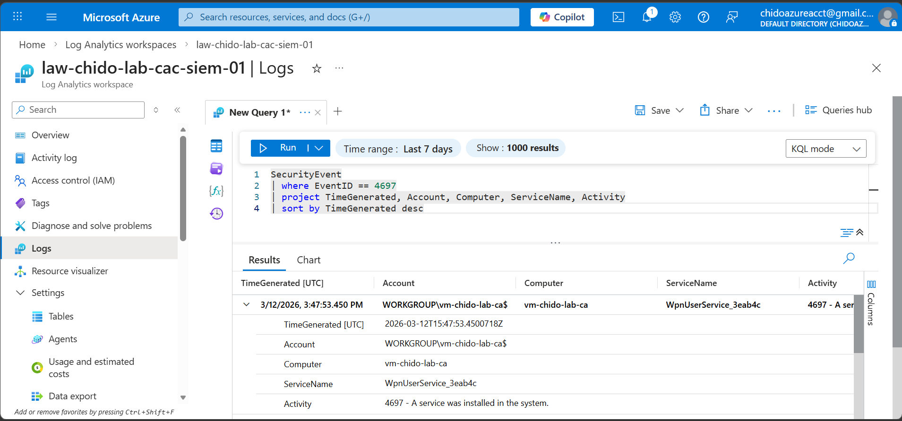

## Detection 8 — Remote Desktop Logon Detection

**`MITRE ATT&CK:`** T1021 – Remote Services

**`Threat Scenario:`** Attackers frequently use Remote Desktop Protocol (RDP) for remote access and lateral movement.

**`Telemetry Source:`** Windows Security Event Log

**`Event ID:`** 4624 – Successful Logon

**`LogonType:`** 10

### Detection Logic

```kql
SecurityEvent
| where EventID == 4624
| where LogonType == 10
| project TimeGenerated, Account, Computer, IpAddress
| sort by TimeGenerated desc
```

### Detection Output

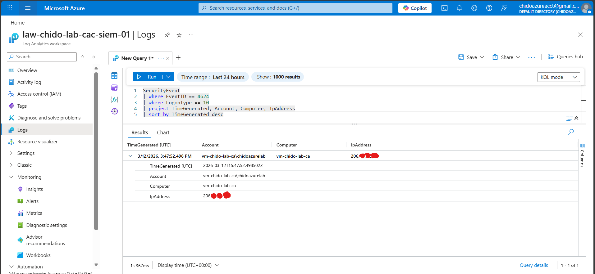


# Microsoft Sentinel Analytics Rule

Detection queries were converted into Sentinel analytics rules to generate alerts automatically.

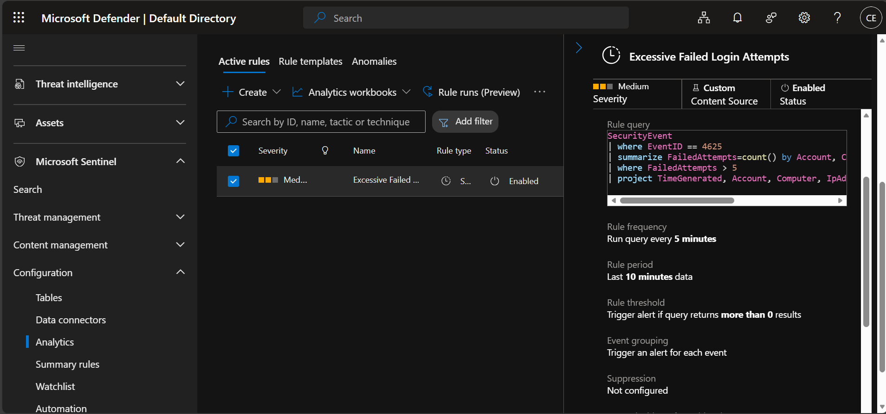


# Sentinel Incident Investigation

When detections trigger, Microsoft Sentinel generates security incidents for investigation.

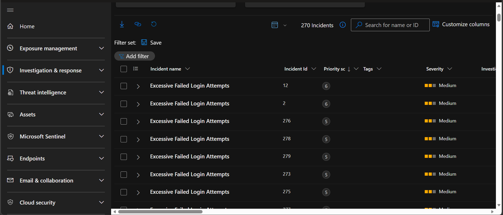


# Skills Demonstrated

- Threat Detection Engineering

- Microsoft Sentinel SIEM

- Kusto Query Language (KQL)

- MITRE ATT&CK Mapping

- Windows Security Log Analysis

- Cloud Security Monitoring

- Attack Simulation and Detection Validation

# Key Takeaways

This project demonstrates how detection engineers transform raw telemetry into actionable threat detections using Microsoft Sentinel.

The detections developed in this lab simulate real attacker behaviors and demonstrate how security teams can identify malicious activity through structured log analysis and detection engineering practices.


